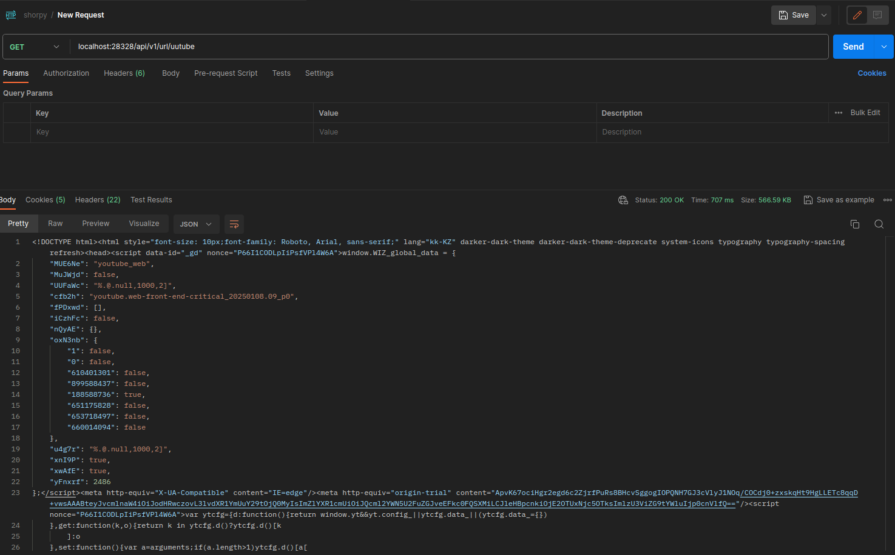
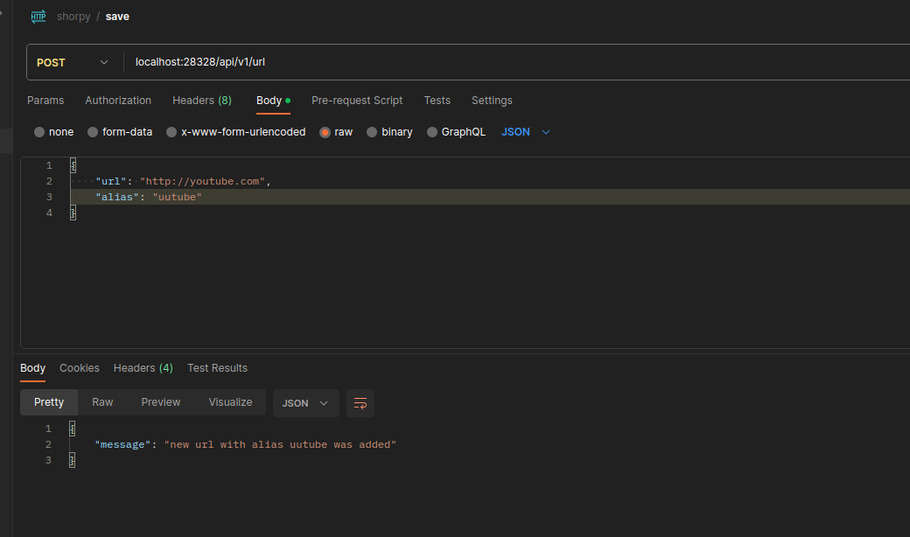

# Shorpy

    This project implements a simple URL shortener API using FastAPI and SQLAlchemy.

## TODO:
    1. User Authentication / Authorization

    2. Delete and Update API Endpoints

## Endpoints

### Redirect

`GET /api/v1/url/{alias}`

Path Parameter:

    alias: The alias of the URL to redirect to.

Response:

    302 Found: Redirects to the original URL if the alias exists.
    404 Not Found: Returns a JSON error response if the alias is not found.



### Save

`POST /api/v1/url`

Request Body (JSON):

    url: The original URL to be shortened.
    alias (optional): A custom alias for the shortened URL. If not provided, a random alias will be generated.

Response:

    200 OK: Returns a success message with the alias of the saved URL.
    409 Conflict: Returns an error if the alias already exists in the database.
    500 Internal Server Error: Returns a generic error if something goes wrong during the save operation.



## Configuration

You can specify path to this configuration file either through `--config` flag when running application or environment variable called `SHORY_CONFIG_PATH` see example in `docker-compose.app-local.yaml`.

This section describes the configuration settings required for the application. These configurations should be placed in a JSON file and adjusted according to your specific environment. Below is an example of how to structure the configuration:

```json
{
    "env": "<environment>",
    "http_server": {
        "port": <server-port>
    },
    "postgres": {
        "dsn": "postgresql+asyncpg://<username>:<password>@<host>:<port>/<database>"
    }
}
```

## Running

### Locally
`You must provide a database and configuration by yourself`

```bash
$ git clone https://github.com/shotowon/shorpy.git
$ cd shorpy
$ python -m venv .venv # declare virtual environment
$ . .venv # activate venv might be OS specific
$ python -m pip install -r requirements.txt # install dependencies
$ mkdir logs # optional, if you are running app in dev or prod environment
$ python -m shorpy.main --config=<path-to-config-file>
# or
$ SHORPY_CONFIG_PATH=<path-to-config-file> python -m shorpy.main
```

### Docker-Compose Demo

```bash
$ git clone https://github.com/shotowon/shorpy.git
$ cd shorpy
$ docker compose -f docker-compose.app-local.yaml up -d # that's all
```